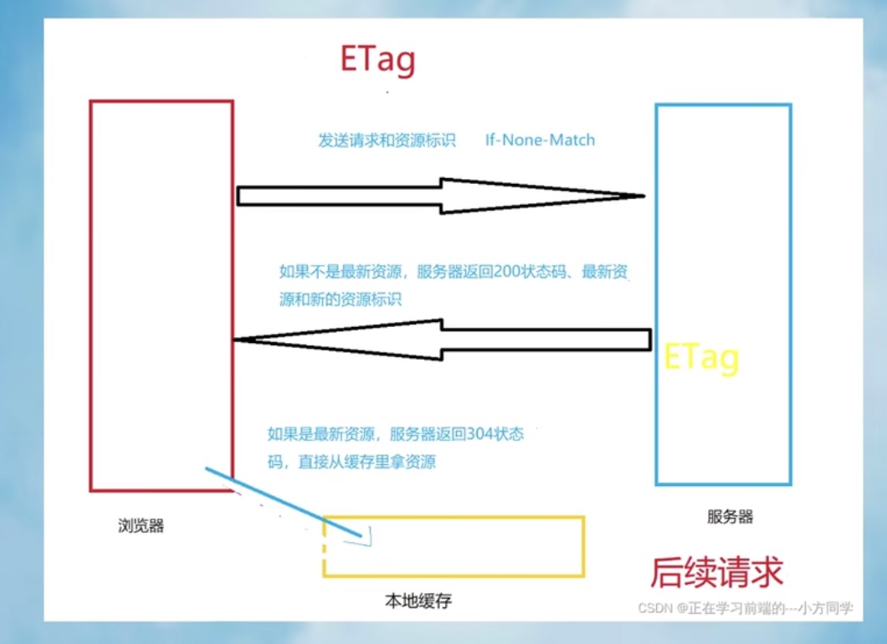

### 浏览器的缓存机制分为强缓存和协商缓存

#### 浏览器缓存机制：浏览器访问某个资源文件时会判断是否使用本地缓存里已经存在的资源文件

#### 缓存优势：1、减轻服务器压力 2、页面加载很快 提升用户体验

#### 强缓存

1. cache-control: 服务器在资源文件响应头中设置 cache-control: max-age = 秒级缓存过期时间，意味着这段时间内浏览器不会再想服务器发送请求 statusCode: 200 (from-disk-cache) 是 http1.1 的协议，优先级高于 1.0 的 Expries

2. Expries: 服务器在资源文件响应头中设置 Expries: 时间值-缓存到期时间，到期时间之前都使用本地的缓存资源。http1.0。这里浏览器会以客户端时间为参照，但是客户端系统的时间是可以修改的，所以会存在误差

#### 协商缓存

1. E-tag: 浏览器初次请求资源时 服务器返回资源并且会在响应头中设置 E-tag: W/78225w6d9-7s7g9, 当浏览器再次请求时会在请求头中携带 <m>if-None-Match:</m> W/78225w6d9-7s7g9. 服务端收到请求后会拿着这个标识到服务器中进行对比，如果一致就返回 304 状态码。否则就返回 200 给到最新的资源文件。 http1.1

2. last-Modified：浏览器初次请求资源时 服务器返回资源并且会在响应头中设置 <m>last-Modified:</m> 文件最新修改日期的时间值 当浏览器再次请求时会在请求头中携带 <m>if-modified-since:</m> 时间值. 服务端收到请求后会拿着这个标识到服务器中进行对比，如果一致就返回 304 状态码。否则就返回 200 给到最新的资源文件。 http1.0

** E-tag 的优先级比 last-Modified 高,也更精确 。因为在编辑文件的时候并没有修改文件内容 但文件修改时间却更改了 **

